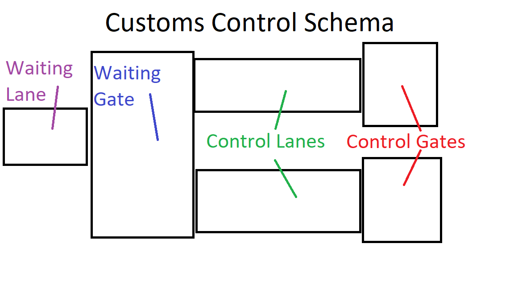
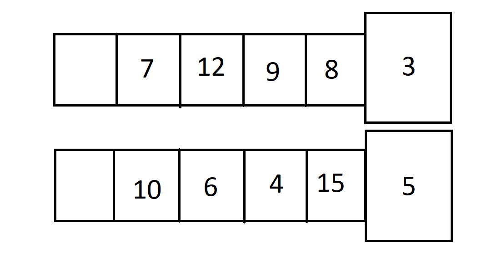
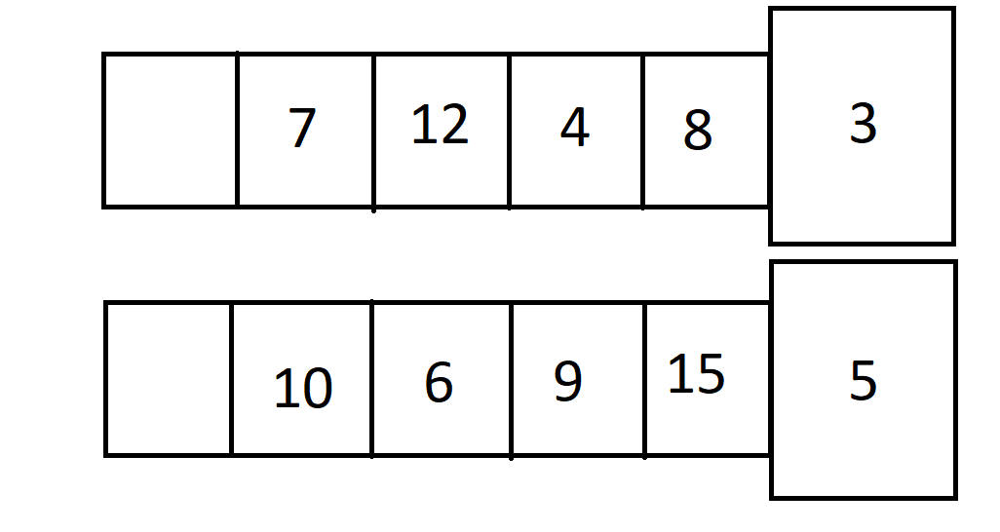
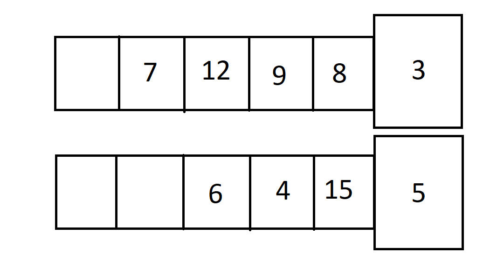
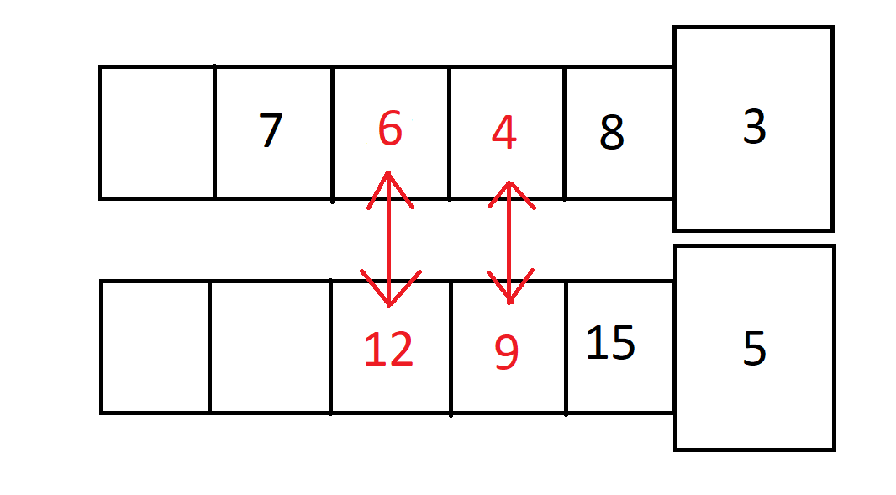
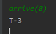
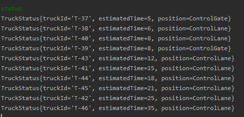
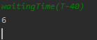
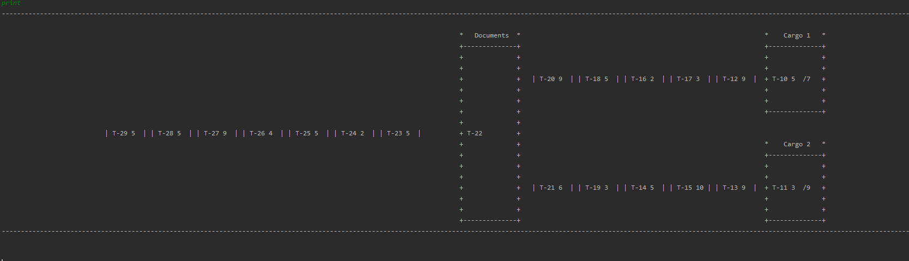

# Truck Customs Control System
System designed to simulate truck movement during customs control

# System introduction and schema

Control Gate - Control gates are responsible for verifying cargo transported by trucks.
There are two control gates in simulation. Time units needed to process truck through cargo control equals weight of a truck.

Control Lane - Control lane is a queue in which trucks wait for access to control gate.
By default there can be 5 trucks in each control lane. There are 2 control lanes in simulation

Waiting Gate - Waiting Gate is a place where documents are verified.
Truck is placed in waiting gate only if there are no free places in control gates and control lanes.
As soon as there appears free slot in control lane, truck is moved.
There is only 1 waiting gate in simulation.

Waiting Lane - Waiting lane is a queue in which trucks wait for access to waiting gate.
There is no limit to trucks amount in waiting lane. There is 1 waiting lane in simulation.

Customs control can be divided into 2 stages.
First - when truck arrives to Documents gateway and hands over control of the truck.
Second - when truck is placed in control lane or control gate, controlled by staff.

The main goal of the simulation is to provide the shortest possible average waiting time
given restrictions that truck can be switched places only with corresponding truck in second queue.
Trucks actually processed in control gates and first in control lane cannot be switched.

The starting turn of the simulation is turn 0.

# Truck placement and route optimization

## Truck placement
As written before the main task is to provide shortest possible average time. 
But due to possible arrival of unexpected truck or change of truck generation parameters
the best possible option for truck placement is to place it in control gate(if there is an empty one) or in quicker control lane (if it has free places).
In situation when there are no free places in control lanes, truck is placed in waiting gate.
If also waiting gate is taken, truck is placed in queue before waiting gate.

## Route optimization
To improve performance of simulation, truck can be switched places with a corresponding truck from other control lane.
Trucks currently processed in control gates and first trucks in control lanes cannot be moved.
Also truck cannot be switched with empty place.

The first thing to notice is that the time needed for truck in control lane to be processed is
a sum of its weight and all its predecessors weights(trucks in front of it).

The second thing to notice is that no time can be saved by switching trucks between lanes if there is same amount of trucks in both lanes.
So the only possibility to save time is to place lighter trucks in longer lanes.

**Route optimization is calculated after passing a time unit**
so after invoking a step 

## Example and proof
Given example where number in square represents a truck and its time needed to be processed

We can count: 
Time for trucks in first lane to be processed as: 3 + 11 + 20 + 32 + 39 = 105 
(since time needed for truck to be processed is time needed for her and all her predecessors)

Time for trucks in second lane to be processed as: 5 + 20 + 24 + 30 + 40 = 119  

So average time for truck equals **22.4** time units [105 + 119 / 10 trucks in simulation]

We can count:
Time for first lane trucks: 3 + 11 + 15 + 27 + 34 = 90 
Time for second lane trucks: 5 + 20 + 29 + 35 + 45 = 134 
With same average time **22.4** units [90 + 134 / 10 trucks in simulation]

This is caused of course by the fact that truck's time to be processed affects only itself
and trucks behind it so it does not matter which lane it affects.

To see possible optimization we should consider example where there is not equal amount of trucks in both lanes

 
Time for first lane trucks: 3 + 11 + 20 + 32 + 39 = 105 
Time for second lane trucks: 5 + 20 + 24 + 30 = 79 
With average time: **20,(4)** time units

Since truck affects itself and trucks behind it, we should place lighter trucks in longer queue
to achieve lower waiting time.

Time for first lane trucks: 3 + 11 + 15 + 21 + 28 = 78 
Time for second lane trucks: 5 + 20 + 29 + 41 = 95 
With average time: **19,(2)** time units

# User interface and how to use

Operations avalaible for user:

- arrive(TruckWeight) -> TruckId
TruckWeight - Integer
Truck with request weight arrives to simulation
Returns Id of new truck
 
Example of usage:

arrive(int)
 

 
- status() -> [TruckStatus]
Returns status of all trucks
 
Example of usage:

status or status()
 

- step()
Moves simulation 1 time unit forward
 
Example of usage:

step or step()

- waitingTime(TruckId) -> Time
TruckId - String
Id of an existing truck in simulation
Returns **estimated** time for truck to leave customs control
 
Example of usage:

waitingTime(String)
 

- generation(Frequency, TruckWeightCap)
 
Frequency - Integer
After this amount of turns, new truck will arrive starting from turn 1 e.g. Frequency = 3, truck arrives turn 4, 7, 10.
_By default frequency is set to 5_
 
TruckWeightCap - Integer
Maximum amount of truck weight. New generated trucks have weight from range **1 to TruckWeightCap**.
_By default truck weight cap is set to 10_
 
Example of usage:

generation(int,int)

- generationOff()
Turns off automatic generation of trucks.
**By default generation is turned on**.
 
Example of usage:

generationOff() or generationOff

- generationOn()
Turns off automatic generation of trucks
**By default generation is turned on**
 
Example of usage:

generationOn() or generationOn
- print()
Prints visualization of current situation
 
Example of usage:

print or print()
 
 

**Please note that print() is designed to be used in intelliJ console,
other consoles may have problems with displaying text**

# How to run

## Running from IDE
Example on IntelliJ: 
This is a Maven project. Import it like a Maven project and select pom.xml to avoid any possible difficulties.
System is designed to run on Java 8. This configuration is enabled in pom.xml
but before run please check that you are using Java 8. 
File -> Project Structure -> Project -> SDK 1.8, Project language level 8 
File -> Project Structure -> Modules -> Language Level 8 
File -> Settings -> Build, Execution, Deployment -> Compiler -> Java Compiler -> version 1.8 
Program does not take any argument to run. All that is left is to launch main() in TruckControlSystemRunner.

## Running with fat jar
There is prepared fat-jar in directory fatjar/ to launch project from any console. 
From parent directory launch: 
$ java -cp fatjar/TruckControlSystem-1.0-SNAPSHOT-jar-with-dependencies.jar TruckControlSystemRunner  
This .jar file is a fatjar (called also uberjar) - it already has all dependencies. 
_Please note that print() function was designed to work properly in IntellIj Idea console
It may not work properly on every console_ 

